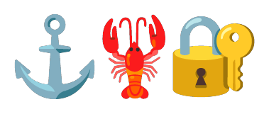

<p align="center">
  
</p>

<h1 align="center">CommandClaw MCP Gateway</h1>

<p align="center">
  <strong>Central MCP hub for Command Claw agents.</strong><br>
  <sub>Agents never see real credentials. The gateway handles authentication. Keys rotate every hour.</sub>
</p>

---

> [!WARNING]
> **🚧 Beta Software** — This project is under active development. Workflows and commands may be incomplete or broken. Your feedback helps make this better!
>
> 💬 **Have feedback or found a bug?** Reach out at [**@_Shikh4r_** on X](https://x.com/_Shikh4r_)

## Why a Separate Gateway?

In OpenClaw, agents interact with external tools via ad-hoc API calls with direct access to credentials. If an agent leaks a key — through a prompt injection, a bad tool call, or a context dump — that key is live until someone manually rotates it.

CommandClaw-MCP solves this with a proxy architecture:

```
Agent → (rotating hourly key) → commandclaw-mcp → (real credentials) → External MCP Servers
```

### Security Model

- **Agents never see real API keys.** The gateway holds all credentials. Agents authenticate to the gateway with a short-lived rotating key.
- **Rotating keys expire every hour.** Even if an agent leaks its gateway key (prompt injection, context dump, log exposure), the blast radius is limited to 60 minutes max.
- **RBAC at the gateway level.** The gateway controls which MCP tools each agent can access. Unauthorized tools are invisible — the agent doesn't even know they exist.
- **Deterministic tool contracts.** MCP defines typed inputs/outputs for every tool. No ad-hoc API formatting. The gateway validates requests before forwarding them.
- **Audit trail.** Every tool call flows through the gateway and is logged — which agent, which tool, when, with what inputs.

### How It Works

1. **Gateway starts** with real MCP server configs (API keys, endpoints, access rules) in `~/.commandclaw/mcp.json`.
2. **Gateway generates** a rotating API key for each agent, refreshed every hour.
3. **Agent connects** to the gateway using its current rotating key.
4. **Agent discovers tools** — the gateway returns only the tools this agent is authorized to use.
5. **Agent calls a tool** — the gateway validates the request, authenticates with the real MCP server, and returns the result.
6. **Key rotates** — old key expires, agent gets a new one. No manual intervention.

## Configuration

### Gateway Config (`~/.commandclaw/mcp.json`)

```json
{
  "gateway": {
    "host": "0.0.0.0",
    "port": 8420,
    "key_rotation_interval_seconds": 3600
  },
  "servers": {
    "notion": {
      "command": "npx",
      "args": ["-y", "@notionhq/notion-mcp-server"],
      "env": { "NOTION_API_KEY": "ntn_..." }
    },
    "github": {
      "command": "npx",
      "args": ["-y", "@modelcontextprotocol/server-github"],
      "env": { "GITHUB_TOKEN": "ghp_..." }
    }
  },
  "access": {
    "coding-agent": ["github", "notion"],
    "research-agent": ["notion"]
  }
}
```

### Agent Config

Agents only need the gateway URL and their current rotating key:

```
COMMANDCLAW_MCP_GATEWAY=http://localhost:8420
COMMANDCLAW_MCP_KEY=<auto-rotated>
```

## Repositories

| Repo | Purpose |
|------|---------|
| [commandclaw](https://github.com/FnSK4R17s/commandclaw) | Agent runtime, Telegram I/O, tracing |
| [commandclaw-skills](https://github.com/FnSK4R17s/commandclaw-skills) | Skills library — `npx skills add FnSK4R17s/commandclaw-skills` |
| [commandclaw-vault](https://github.com/FnSK4R17s/commandclaw-vault) | Vault template — clone to create a new agent |
| [commandclaw-mcp](https://github.com/FnSK4R17s/commandclaw-mcp) | MCP gateway — credential proxy with rotating keys |
